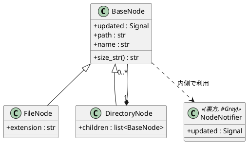

# 『Q』の陰影を払うまで

2026.06.26 ・ Python / PySide6 / 設計の話

---

## きっかけ

自分のコードを可視化したかった。でも、PlantUMLの構文をいちいち手打ちするのは面倒だし、かといってツールに全部やらせると、設計を考える楽しさが消えてしまう。

そのちょうど中間を探しながら、Geminiを「壁打ち相手」として使い、Pythonのファイルシステムコードをクラス図に写し取ることにした。

---

## 招かれざる客

VSCodeのプレビューに浮かんだのは、思ったより綺麗なクラス図だった。`BaseNodeObject` を中心に、ファイルとディレクトリが枝分かれし、関係性が可視化されていた。

が、図の最上部にどかんと居座る影がひとつ。

**`QObject`** だった。

Signalを使うという技術的な都合で、仕方なく継承したライブラリのクラス。それが、精魂込めて作ったドメインモデルの世界観を「Qtの借り物」に染め上げていた。

「`QObject` っていう名前、なんか気に入らないな……」

---

## 後悔は、一段上がったサイン

リリースした後に図を書いて後悔する。それは手遅れではなく、自分の設計眼が上がった証拠だと思うことにした。

この『Q』を消し去るルートは3つある。

**1. カモフラージュ**
`BindableModel = QObject` と別名をつけて、コードからQtの気配を覆い隠す。

**2. 隠蔽（ラッパー）**
`QObject` の継承をやめ、Signal通知用の裏方クラスを自分のクラスの内側にそっと閉じ込める。

**3. 主役の奪還**
自分のクラスを `FileSystemEntry` や `BaseNode` にリネームし、名前の格好良さで主役の座を奪い返す。

---

## 次のクラス図

「2. 隠蔽」を選んだとき、図はこうなる。あの無骨な `QObject <|--` の矢印が消える。

動くコードはすでにある。次は、図を見ながら設計にしよう。
